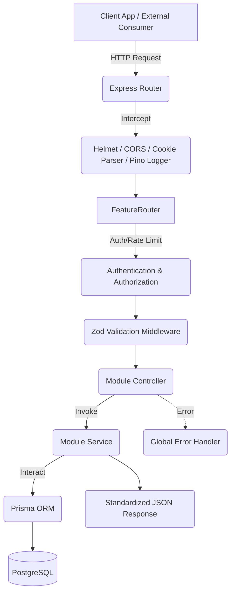

# Backend Architecture Specification - APIMeter

**Project:** APIMeter
**Tagline:** Secure API Key Management & Real-Time Usage Analytics Platform
**Version:** 1.2

---

## SECTION 1 — Architecture Overview

**Selected Architecture:** Feature-First Layered Architecture (Express.js)

APIMeter backend is built as a standalone **Express.js** API using **TypeScript**. It utilizes a strict Feature-First modular structure. The core business logic remains entirely decoupled from the HTTP transport layer. There is no traditional MVC grouping (no global `controllers/` or `services/` folders). Instead, each feature domain is self-contained.

---

## SECTION 2 — High-Level System Architecture (Request Flow)



---

## SECTION 3 — Feature-First Module Structure

The backend is divided into strict feature modules inside `src/modules/` to prevent a monolithic design. There is no Repository layer; Services interact with Prisma directly.

### Standard Module Layout

Each module follows this exact structure:
```text
module-name/
├── module.controller.ts  # Handles HTTP req/res and delegates to service
├── module.service.ts     # Business logic and DB interactions (Prisma)
├── module.routes.ts      # Express Router definitions for this module
├── module.validator.ts   # Zod schemas for payload validation
├── module.types.ts       # Module-specific TypeScript interfaces
└── index.ts              # Public exports for the module
```

### 1. Auth Module
*   **Responsibilities:** Authentication APIs, Session/JWT validation, Password hashing.
*   *Note: Frontend is responsible for the Login/Register UI, but Backend issues the tokens and maintains session security.*

### 2. Projects Module
*   **Responsibilities:** Tenant isolation, Project CRUD, handling URL-safe `slugs`.

### 3. API Keys Module
*   **Responsibilities:** Key Generation, Hashing, Revocation, Edge Validation.
*   **Security Rule:** Keys are immediately hashed upon generation. The incoming plaintext key is hashed and strictly compared against the `hashedKey` in the DB.

### 4. API Requests Module
*   **Responsibilities:** Ingesting high-velocity telemetry data from API consumers.

### 5. Analytics Module
*   **Responsibilities:** Aggregating time-series data via an Aggregation Layer that safely queries API Requests without exposing raw table data.

### 6. Settings Module
*   **Responsibilities:** Split internally into Profile and Preferences management.

---

## SECTION 4 — Folder Structure

```text
backend/
├── src/
│   ├── app.ts            # Express application bootstrap & global middleware
│   ├── server.ts         # Server listen initialization
│   ├── config/           # Environment variables (Zod + env-core)
│   ├── constants/        # Application-wide constants
│   ├── middleware/       # Global Express middlewares
│   ├── shared/           # Shared utilities across modules
│   │   ├── errors/       # Custom Error classes
│   │   ├── logger/       # Pino logger configuration
│   │   ├── response/     # Standard API response builders
│   │   └── validators/   # Reusable Zod schemas
│   ├── types/            # Global TypeScript definitions
│   ├── utils/            # Helper functions
│   └── lib/              # Third-party library initializations (e.g., Prisma)
│   ├── modules/
│   │   ├── auth/
│   │   ├── projects/
│   │   ├── api-keys/
│   │   ├── api-requests/
│   │   ├── analytics/
│   │   └── settings/
```

---

## SECTION 5 — Dependency Rules

| From Layer | To Layer | Allowed? |
| :--- | :--- | :--- |
| **Controller** | **Service** | ✅ Yes |
| **Controller** | **Prisma (Direct)** | ❌ No |

---

## SECTION 6 — Server Bootstrap & Middleware

### Application Bootstrapping (`app.ts` -> `server.ts`)
1. **Express App Instantiation**
2. **Configuration:** Environment variables validated via `@t3-oss/env-core`.
3. **Global Middleware:** `helmet`, `cors`, `compression`, `cookie-parser`, `pino-http`.
4. **Routes:** Feature modules are mounted onto the main router.
5. **404 Handler:** Catches unmatched routes.
6. **Global Error Handler:** Catches thrown exceptions and formats them securely.
7. **Server Listen:** Bind to port (via `server.ts`).

### Shared Middleware
*   **Authentication:** Verifies JWT/Sessions and attaches user context to `req.user`.
*   **Authorization:** RBAC and ownership checks.
*   **Validation:** Express middleware that intercepts requests and validates `req.body`/`req.query` using Zod schemas.
*   **Error Handler:** Formats custom application errors into standardized JSON responses.
*   **Request Logger:** `pino-http` for structured JSON logging.
*   **Rate Limiter:** *(Future implementation)*

---

## SECTION 7 — Testing Strategy

*   **Framework:** `Vitest` for fast, native TypeScript testing.
*   **Integration:** `Supertest` is used to mock Express HTTP requests during integration tests.
*   **Scope:** Services are unit tested in isolation. Controllers/Routes are integration tested via Supertest.

---

## SECTION 8 — BACKEND DECISIONS (Architecture Decision Records)

*(Generated from Architecture Revision v1.2)*
*   **ADR-BE-6:** Framework migration from Next.js API Routes to Express.js. **Reason:** To decouple the backend completely from the frontend framework, allowing for better scalability, traditional middleware pipelines, and strict REST boundaries. **Status:** Approved.
*   **ADR-BE-7:** Adoption of Pino for logging. **Reason:** High-performance, structured JSON logging ideal for backend microservices. **Status:** Approved.
*   **ADR-BE-8:** Removal of Repository Layer. **Reason:** Prisma's strongly-typed client effectively acts as the repository. Wrapping it adds unnecessary boilerplate in a feature-first architecture. **Status:** Approved.

---
*End of Backend Architecture Specification*
