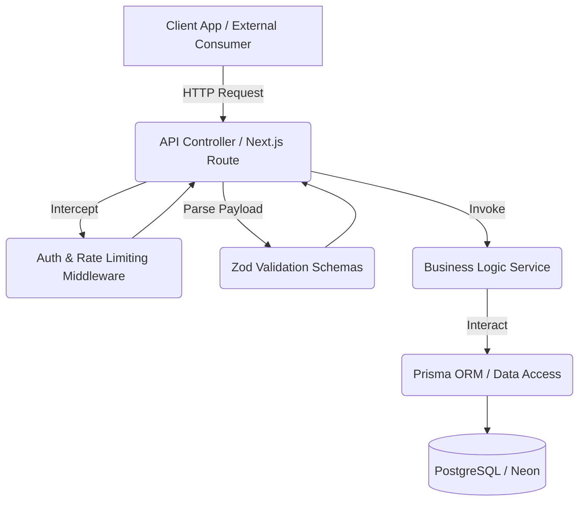
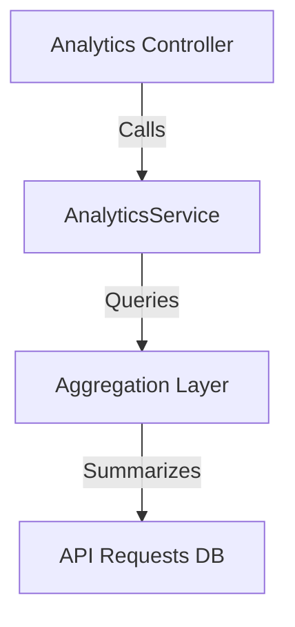

# Backend Architecture Specification - APIMeter

**Project:** APIMeter
**Tagline:** Secure API Key Management & Real-Time Usage Analytics Platform
**Version:** 1.1

---

## SECTION 1 — Architecture Overview

**Selected Architecture:** Feature-First Layered Architecture

APIMeter utilizes a hybrid between a Feature-First modular structure and a strict Layered dependency graph. Next.js App Router forces a certain amount of file-system routing, but our core business logic remains entirely decoupled from the HTTP transport layer.

---

## SECTION 2 — High-Level System Architecture



---

## SECTION 3 — Feature-First Module Architecture

The backend is divided into strict feature modules to prevent a monolithic "God Service".

### 1. Auth Module
*   **Responsibilities:** Registration, Login, Session Management.

### 2. Projects Module
*   **Responsibilities:** Tenant isolation, Project CRUD, handling URL-safe `slugs`.
*   **Owned Files:** `project.service.ts`, `project.repo.ts`, `project.validator.ts`

### 3. API Keys Module
*   **Responsibilities:** Key Generation, Hashing, Revocation, Edge Validation.
*   **Security Rule:** Keys are immediately hashed upon generation. The incoming plaintext key is hashed and strictly compared against the `hashedKey` in the DB.

### 4. API Requests Module (Formerly Request Logs)
*   **Responsibilities:** Ingesting high-velocity telemetry data from API consumers.
*   **Public Interface:** `logRequest()`, `getRequests()`
*   **Owned Files:** `api-request.service.ts`, `api-request.repo.ts`

### 5. Analytics Module
*   **Responsibilities:** Aggregating time-series data via an Aggregation Layer that safely queries API Requests without exposing raw table data.
*   **Owned Files:** `analytics.service.ts`

### 6. Activity Logs Module
*   **Responsibilities:** Emitting standardized audit events (`entityType`, `entityId`, `action`, `actorId`, `metadata`, `timestamp`).

### 7. Settings Module
*   **Responsibilities:** Split internally into `ProfileService` and `PreferencesService`.

---

## SECTION 4 — Folder Structure

```text
backend/
├── src/
│   ├── lib/
│   │   ├── modules/
│   │   │   ├── projects/       # -> project.service.ts
│   │   │   ├── api-keys/       # -> key.service.ts
│   │   │   ├── api-requests/   # -> api-request.service.ts
│   │   │   ├── analytics/      # -> analytics.service.ts
│   │   │   └── settings/       # -> profile.service.ts, preferences.service.ts
```

---

## SECTION 5 — Dependency Rules

| From Layer | To Layer | Allowed? |
| :--- | :--- | :--- |
| **Controller** | **Service** | ✅ Yes |
| **Controller** | **Prisma (Direct)** | ❌ No |

---

## SECTION 6 — Analytics Architecture

Analytics MUST NEVER directly expose raw API Request tables to the frontend.

*Note: In V1, the Aggregation Layer queries the raw tables. In V2, this will be swapped to Materialized Views seamlessly.*

---

## SECTION 7 — BACKEND DECISIONS (Architecture Decision Records)

*(Generated from Architecture Revision v1.1)*
*   **ADR-BE-1:** Module `request-logs` renamed to `api-requests`. **Reason:** Semantic correctness; they are raw requests, not just passive logs. **Status:** Approved.
*   **ADR-BE-2:** `APIRequestService` replaces old logging service. **Reason:** Alignment with module naming. **Status:** Approved.
*   **ADR-BE-3:** All authentication edge comparisons must hash the incoming Bearer token and compare to `hashedKey`. Plaintext keys are never stored. **Reason:** Prevents DB dumps from compromising client API keys. **Status:** Approved.
*   **ADR-BE-4:** Settings Module split into Profile and Preferences services. **Reason:** Separation of concerns. **Status:** Approved.
*   **ADR-BE-5:** Analytics must use an Aggregation abstraction. **Reason:** Allows future integration of Redis or summary tables without rewriting the Controller. **Status:** Approved.

---
*End of Backend Architecture Specification*
