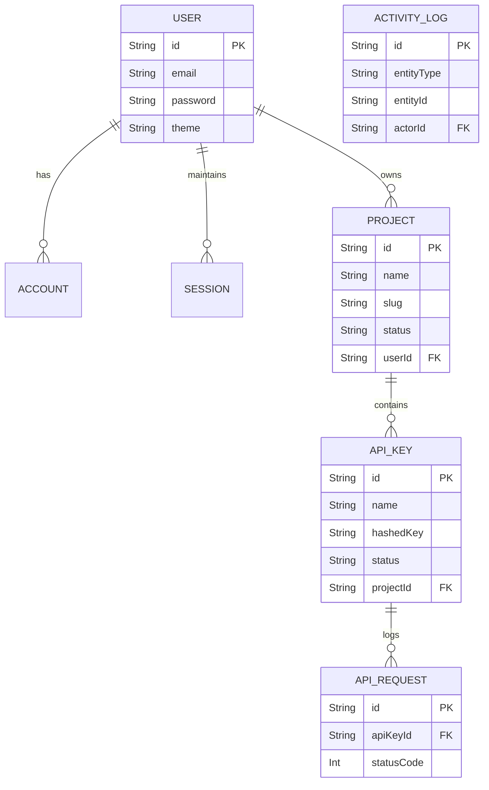

# Database Design Document
**Project Name:** APIMeter
**Version:** 1.1.0
**Status:** Approved

---

## 1. DATABASE OVERVIEW

**Why PostgreSQL?**
PostgreSQL is chosen for its ACID compliance, robust handling of concurrent transactions, advanced indexing capabilities (BRIN, B-Tree, JSONB), and ecosystem maturity. It provides the strict data integrity required for security products while scaling effortlessly for analytical queries (usage logs).

**Why Prisma?**
Prisma ORM offers unparalleled type-safety in TypeScript ecosystems. It accelerates development by generating a strictly typed client based on the schema, ensuring the database and application layer (Next.js) are always in sync. Its schema file serves as an excellent source of truth.

**Why a relational database?**
API key management is inherently relational: Users own Projects, Projects own API Keys, API Keys generate API Requests. Enforcing referential integrity (e.g., deleting a project cascades to its keys) is critical. 

**Advantages & Trade-offs:**
*   *Advantage:* Strict constraints prevent orphaned records and data anomalies.
*   *Trade-off:* High-velocity inserts (API Requests) can stress relational databases compared to NoSQL or Time-Series DBs.
*   *Future Scalability:* For V1, Postgres is sufficient. As we approach 500M+ requests, the `ApiRequest` table can be partitioned in Postgres or migrated to ClickHouse, keeping the core relational data in Postgres.

---

## 2. DATABASE DESIGN PRINCIPLES

*   **Terminology Note:** The UI will display "Request Logs" for user comprehension. Internally (Database, Models, Services), this is strictly referred to as **API Requests**. Analytics are derived aggregations and must NEVER be confused with raw API Requests.
*   **Naming Convention:** Tables/Models use PascalCase in Prisma (`User`), mapping to lowercase plural in Postgres (`users`). Columns use camelCase in Prisma, mapping to snake_case in Postgres (e.g., `createdAt` -> `created_at`).
*   **Primary Keys:** We will use `cuid()` (Collision Resistant Unique Identifier v2) for all primary keys. They are URL-safe, decentralized, and chronologically sortable (unlike UUID v4).
*   **Foreign Keys:** Strictly enforced. Cascading deletes will be used carefully.
*   **Indexes:** Every foreign key column will be indexed. Analytics-heavy columns will have specialized indexes.
*   **Enums:** Used for strict status tracking (e.g., Key Status: `ACTIVE`, `REVOKED`, `EXPIRED`) to prevent string typos.
*   **Timestamps:** Every table has `createdAt` and `updatedAt`.
*   **Soft Deletes:** Applied to `User` and `Project` entities via `deletedAt` timestamp (Status set to `ARCHIVED`).
*   **Audit Strategy:** Separate `ActivityLog` table to immutably record security events.
*   **Security:** API Keys are NEVER stored in plaintext. Only the `hashedKey` is stored.

---

## 3. ENTITY IDENTIFICATION

1.  **User:** Represents a human interacting with the APIMeter dashboard. Contains profile and application preferences.
2.  **Account:** Auth.js requirement for linking OAuth providers (e.g., GitHub) to Users.
3.  **Session:** Auth.js requirement for tracking active web sessions.
4.  **VerificationToken:** Auth.js requirement for magic links/password resets.
5.  **Project:** A logical workspace/environment belonging to a User. Contains a unique URL-safe `slug`.
6.  **ApiKey:** A cryptographic token generated within a Project to authenticate API requests.
7.  **ApiRequest:** An immutable record of a single raw API request made using an ApiKey.
8.  **ActivityLog:** An immutable audit record of an action performed on an entity.

---

## 4. ENTITY RELATIONSHIPS

*   **User (1) to (M) Account:** A user can have multiple OAuth accounts.
*   **User (1) to (M) Session:** A user can be logged in on multiple devices.
*   **User (1) to (M) Project:** A user can create multiple projects. (Delete behavior: Soft Delete).
*   **Project (1) to (M) ApiKey:** A project contains multiple API keys. (Delete behavior: Cascade).
*   **ApiKey (1) to (M) ApiRequest:** A specific key is responsible for many API requests. (Delete behavior: Cascade or Set Null depending on retention policy; V1 uses Cascade).

---

## 5. ER DIAGRAM



---

## 6. TABLE DEFINITIONS

### Table: `users`
*   **Purpose:** Core identity, authentication, profile settings, and application preferences.
*   **Columns:** `id` (PK, CUID), `name` (String, Nullable), `email` (String, Unique), `email_verified` (DateTime, Nullable), `password` (String, Nullable), `image` (String, Nullable), `theme` (String, Default 'system'), `timezone` (String, Default 'UTC'), `date_format` (String, Default 'YYYY-MM-DD'), `created_at` (DateTime), `updated_at` (DateTime), `deleted_at` (DateTime, Nullable).
*   **Indexes:** `idx_user_email`.

### Table: `projects`
*   **Purpose:** Workspaces to group keys.
*   **Columns:** `id` (PK, CUID), `name` (String), `slug` (String, Unique), `description` (String, Nullable), `status` (Enum: ACTIVE, ARCHIVED), `user_id` (FK), `created_at` (DateTime), `updated_at` (DateTime), `deleted_at` (DateTime, Nullable).
*   **Constraints:** `slug` must be URL-safe and globally unique.
*   **Indexes:** `idx_project_user_id`, `idx_project_slug`.

### Table: `api_keys`
*   **Purpose:** Store API key credentials securely.
*   **Columns:** `id` (PK, CUID), `name` (String), `key_prefix` (String), `hashed_key` (String, Unique), `project_id` (FK), `status` (Enum: ACTIVE, REVOKED, EXPIRED), `expires_at` (DateTime, Nullable), `last_used_at` (DateTime, Nullable), `created_at` (DateTime), `updated_at` (DateTime).
*   **Constraints:** `hashed_key` must be unique.
*   **Indexes:** `idx_apikey_project_id`, `idx_apikey_hashed_key`.

### Table: `api_requests`
*   **Purpose:** High-volume logging of raw API usage.
*   **Columns:** `id` (PK, CUID), `api_key_id` (FK), `endpoint` (String), `method` (String), `status_code` (Int), `latency_ms` (Int), `ip_address` (String, Nullable), `user_agent` (String, Nullable), `created_at` (DateTime).
*   **Indexes:** `idx_apireq_apikey_created` (Composite: `api_key_id`, `created_at`).

### Table: `activity_logs`
*   **Purpose:** Audit trails for entities.
*   **Columns:** `id` (PK, CUID), `entity_type` (String), `entity_id` (String), `action` (String), `actor_id` (String, FK, Nullable), `metadata` (JSONB), `timestamp` (DateTime).
*   **Indexes:** `idx_actlog_entity_id`, `idx_actlog_actor_id`.

---

## 7. ENUM DESIGN
*   **`KeyStatus`**: `ACTIVE`, `REVOKED`, `EXPIRED`.
*   **`ProjectStatus`**: `ACTIVE`, `ARCHIVED`.

---

## 8. ANALYTICS ARCHITECTURE

Analytics must NEVER directly expose raw `api_requests` tables to the frontend. The `AnalyticsService` acts as an aggregation layer. In V1, this aggregation layer queries the `api_requests` table directly. In future versions, this layer can be replaced by Materialized Views or Redis without altering the API Contract.

---

## 9. PRISMA SCHEMA

```prisma
generator client {
  provider = "prisma-client-js"
}

datasource db {
  provider = "postgresql"
  url      = env("DATABASE_URL")
}

// ==========================================
// ENUMS
// ==========================================

enum KeyStatus {
  ACTIVE
  REVOKED
  EXPIRED
}

enum ProjectStatus {
  ACTIVE
  ARCHIVED
}

// ==========================================
// AUTH.JS MODELS
// ==========================================

model Account {
  id                String  @id @default(cuid())
  userId            String  @map("user_id")
  type              String
  provider          String
  providerAccountId String  @map("provider_account_id")
  refresh_token     String? @db.Text
  access_token      String? @db.Text
  expires_at        Int?
  token_type        String?
  scope             String?
  id_token          String? @db.Text
  session_state     String?

  user User @relation(fields: [userId], references: [id], onDelete: Cascade)

  @@unique([provider, providerAccountId])
  @@map("accounts")
}

model Session {
  id           String   @id @default(cuid())
  sessionToken String   @unique @map("session_token")
  userId       String   @map("user_id")
  expires      DateTime
  user         User     @relation(fields: [userId], references: [id], onDelete: Cascade)

  @@map("sessions")
}

model VerificationToken {
  identifier String
  token      String   @unique
  expires    DateTime

  @@unique([identifier, token])
  @@map("verification_tokens")
}

// ==========================================
// CORE BUSINESS MODELS
// ==========================================

model User {
  id            String    @id @default(cuid())
  name          String?
  email         String?   @unique
  emailVerified DateTime? @map("email_verified")
  password      String?
  image         String?
  
  // Application Preferences
  theme         String    @default("system")
  timezone      String    @default("UTC")
  dateFormat    String    @map("date_format") @default("YYYY-MM-DD")
  
  createdAt     DateTime  @default(now()) @map("created_at")
  updatedAt     DateTime  @updatedAt @map("updated_at")
  deletedAt     DateTime? @map("deleted_at")

  accounts      Account[]
  sessions      Session[]
  projects      Project[]

  @@map("users")
}

model Project {
  id          String        @id @default(cuid())
  name        String        @db.VarChar(50)
  slug        String        @unique @db.VarChar(100)
  description String?       @db.VarChar(255)
  status      ProjectStatus @default(ACTIVE)
  userId      String        @map("user_id")

  createdAt   DateTime      @default(now()) @map("created_at")
  updatedAt   DateTime      @updatedAt @map("updated_at")
  deletedAt   DateTime?     @map("deleted_at")

  user        User          @relation(fields: [userId], references: [id], onDelete: Restrict)
  apiKeys     ApiKey[]

  @@index([userId])
  @@index([slug])
  @@map("projects")
}

model ApiKey {
  id          String    @id @default(cuid())
  name        String    @db.VarChar(50)
  keyPrefix   String    @map("key_prefix") @db.VarChar(20)
  hashedKey   String    @unique @map("hashed_key") @db.VarChar(255)
  projectId   String    @map("project_id")
  status      KeyStatus @default(ACTIVE)
  
  expiresAt   DateTime? @map("expires_at")
  lastUsedAt  DateTime? @map("last_used_at")
  createdAt   DateTime  @default(now()) @map("created_at")
  updatedAt   DateTime  @updatedAt @map("updated_at")

  project     Project   @relation(fields: [projectId], references: [id], onDelete: Cascade)
  apiRequests ApiRequest[]

  @@index([projectId])
  @@map("api_keys")
}

model ApiRequest {
  id          String   @id @default(cuid())
  apiKeyId    String   @map("api_key_id")
  endpoint    String   @db.VarChar(255)
  method      String   @db.VarChar(10)
  statusCode  Int      @map("status_code")
  latencyMs   Int      @map("latency_ms")
  ipAddress   String?  @map("ip_address") @db.VarChar(45)
  userAgent   String?  @map("user_agent") @db.Text
  
  createdAt   DateTime @default(now()) @map("created_at")

  apiKey      ApiKey   @relation(fields: [apiKeyId], references: [id], onDelete: Cascade)

  @@index([apiKeyId, createdAt(sort: Desc)])
  @@map("api_requests")
}

model ActivityLog {
  id          String     @id @default(cuid())
  entityType  String     @map("entity_type")
  entityId    String     @map("entity_id")
  action      String
  actorId     String?    @map("actor_id")
  metadata    Json?
  
  timestamp   DateTime   @default(now())

  @@index([entityId])
  @@index([actorId])
  @@map("activity_logs")
}
```

---

## 10. DATABASE DECISIONS (Architecture Decision Records)

*(Generated from Architecture Revision v1.1)*
*   **ADR-DB-1:** Use `API Requests` terminology internally. **Reason:** Distinguishes raw logs from derived analytics. **Status:** Approved.
*   **ADR-DB-2:** Only store `hashedKey`. **Reason:** Eliminates plain-text compromise risk. **Status:** Approved.
*   **ADR-DB-3:** Generic ActivityLog Schema (`entityType`, `entityId`, `action`, `actorId`, `metadata`, `timestamp`). **Reason:** Decouples audit logs from rigid foreign keys, allowing any entity to be audited. **Status:** Approved.
*   **ADR-DB-4:** Add `slug` to Projects. **Reason:** Future-friendly, URL-safe routing (e.g., `/projects/weather-api`). **Status:** Approved.
*   **ADR-DB-5:** `KeyStatus` uses `ACTIVE`, `REVOKED`, `EXPIRED`. **Reason:** Clarifies lifecycle states. **Status:** Approved.
*   **ADR-DB-6:** `ProjectStatus` uses `ACTIVE`, `ARCHIVED`. **Reason:** Clarifies soft-delete UI semantics. **Status:** Approved.

---
*End of Document*
