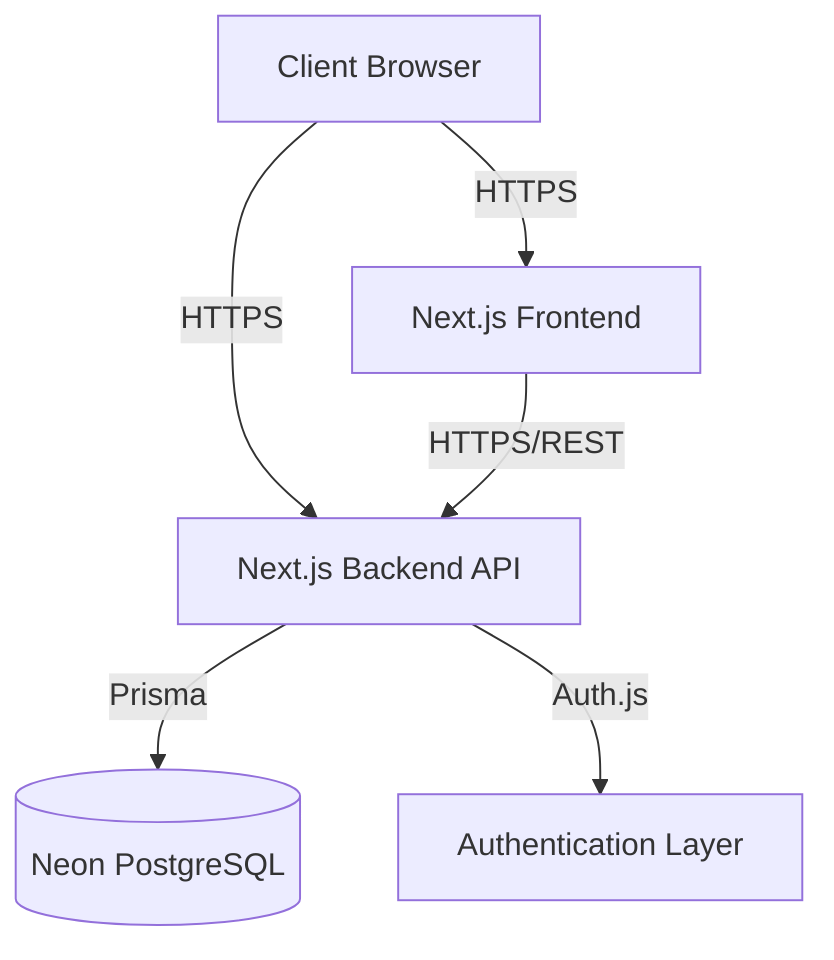

# Software Requirements Specification (SRS)
**Project Name:** APIMeter
**Version:** 1.0.0
**Status:** Draft

---

## 1 Executive Summary
**Purpose:** This document specifies the complete software requirements for APIMeter, guiding frontend and backend engineering teams in building a secure, scalable API key management platform.
**Scope:** Covers Version 1.0 features: Authentication, Project Management, API Key Generation/Revocation, and Usage Analytics.
**Objectives:** Provide an unambiguous technical blueprint that adheres to the PRD and Global Engineering Rules.
**Audience:** Software Engineers, DevOps, QA, and Product Owners.
**Definitions:**
- **Key:** A cryptographic string used to authenticate API requests.
- **Roll:** Generating a new API key while keeping the old one active for a grace period.
**Abbreviations:**
- **PRD:** Product Requirements Document
- **RBAC:** Role-Based Access Control
**References:** APIMeter PRD v1.0.0.

---

## 2 System Overview
APIMeter uses a decoupled, serverless architecture deployed on Vercel.

**High-Level Architecture:**


**System Components:**
- **Frontend:** Next.js 16 (App Router), React 19, Tailwind CSS, Shadcn UI, Zustand, TanStack Query.
- **Backend:** Next.js 16 (Separate Repo/Folder), exposing REST APIs.
- **Database:** Neon PostgreSQL (Serverless).
- **Authentication:** Auth.js with credentials and OAuth providers.
- **API Layer:** Stateless REST endpoints validated via Zod.
- **Deployment:** Vercel (Edge network).

---

## 3 Functional Requirements

### 3.1 Authentication
- **Description:** Handle user identity.
- **Inputs:** Email, Password, OAuth Tokens.
- **Outputs:** JWT Session Token, User Profile.
- **Business Logic:** Hash passwords using bcrypt (cost 12).
- **Validation:** Valid email format, password > 8 chars.
- **Acceptance Criteria:** User can login and receive HTTP-only session cookie.
- **Error Cases:** 401 Unauthorized (Invalid credentials).
- **Dependencies:** Auth.js, User Database Table.
- **Priority:** Must Have.

### 3.2 Dashboard
- **Description:** Landing view post-login showing high-level stats.
- **Inputs:** `projectId`, `dateRange`.
- **Outputs:** Aggregated JSON stats (total requests, active keys, error rate).
- **Business Logic:** Query `RequestLog` table, grouped by date.
- **Validation:** Valid `projectId` owned by user.
- **Acceptance Criteria:** Renders charts in < 1.5s.
- **Error Cases:** 403 Forbidden.
- **Priority:** Must Have.

### 3.3 Projects
- **Description:** Organizational boundaries for keys.
- **Inputs:** Project Name, Description.
- **Outputs:** `Project` object.
- **Business Logic:** Automatically assign creator as OWNER.
- **Validation:** Name max 50 chars.
- **Acceptance Criteria:** User can CRUD projects.
- **Error Cases:** 409 Conflict (Name exists - if unique constraint applies).
- **Priority:** Must Have.

### 3.4 API Keys
- **Description:** The core generation and management of keys.
- **Inputs:** Key Name, Expiry Date, `projectId`.
- **Outputs:** Generated Key (once), Key Metadata.
- **Business Logic:** Generate cryptographically secure random string. Prefix with `apm_`. Hash via SHA-256 for storage. Store last 4 chars in plaintext.
- **Validation:** Key name required. Expiry must be future date.
- **Acceptance Criteria:** Key is shown once. Revocation invalidates it instantly.
- **Error Cases:** 400 Bad Request.
- **Priority:** Must Have.

### 3.5 Request Logs
- **Description:** Ingesting and querying API usage logs.
- **Inputs:** Filter params (keyId, statusCode, dateRange).
- **Outputs:** Paginated list of log entries.
- **Business Logic:** Fetch from DB with offset/cursor pagination.
- **Validation:** Limit max fetch range to 30 days.
- **Acceptance Criteria:** Returns 50 items per page under 500ms.
- **Priority:** Should Have.

### 3.6 Analytics
- **Description:** Processed log data for charting.
- **Inputs:** Timeframe (24h, 7d, 30d).
- **Outputs:** Time-series data points.
- **Business Logic:** Group by hour/day based on timeframe.
- **Priority:** Must Have.

### 3.7 Activity Logs
- **Description:** Internal audit trails (who did what).
- **Inputs:** Action type (e.g., `KEY_CREATED`).
- **Outputs:** Audit log feed.
- **Priority:** Should Have.

### 3.8 Search
- **Description:** Global search for keys and projects.
- **Priority:** Should Have.

### 3.9 Settings
- **Description:** Workspace configurations and limits.
- **Priority:** Must Have.

### 3.10 Profile
- **Description:** User account management.
- **Priority:** Must Have.

---

## 4 Non Functional Requirements
- **Performance:** APIs must resolve in < 200ms. Key Validation API < 50ms (P95).
- **Security:** Zero plaintext keys in DB.
- **Reliability:** 99.9% API uptime.
- **Availability:** Edge deployments to reduce regional latency.
- **Scalability:** DB schema indexed to handle millions of logs.
- **Maintainability:** Strict Clean Architecture (Controller -> Service -> Repository).
- **Accessibility:** WCAG 2.1 AA compliant UI.
- **Usability:** Keyboard shortcuts for power users.
- **Monitoring:** Sentry for errors, Vercel Analytics for web vitals.
- **Logging:** Pino JSON logger.

---

## 5 Authentication Requirements
- **Registration:** Email/Password and GitHub OAuth.
- **Login:** Rate-limited to 5 failed attempts per 15 minutes.
- **Logout:** Invalidates server-side session.
- **Session Management:** Secure HTTP-only cookies. 7-day expiry.
- **Password Reset:** Secure token via email, expires in 15 mins.
- **Email Verification (Future):** Required before creating a project.
- **OAuth (Future):** Google, GitLab.
- **RBAC:** Enforced via middleware.

---

## 6 Authorization Matrix
| Module | Owner | Admin | Member | Viewer |
| :--- | :--- | :--- | :--- | :--- |
| **Projects** | Manage | Read, Update | Read | Read |
| **API Keys** | Manage | Manage | Read, Create | Read |
| **Request Logs** | Read | Read | Read | Read |
| **Settings** | Manage | Update | Read | None |
| **Team/RBAC** | Manage | None | None | None |
| **Billing** | Manage | None | None | None |
*(Manage = Create, Read, Update, Delete, Export)*

---

## 7 Validation Rules
- **Email:** Standard RFC 5322 regex.
- **Password:** Min 8 chars, 1 uppercase, 1 number.
- **Project Name:** 3-50 chars, alphanumeric and spaces.
- **API Key Name:** 3-50 chars.
- **Search:** Sanitize against SQL injection, max 100 chars.
- **Pagination:** `page` > 0, `limit` between 10 and 100.
- **Filters:** Valid enums only (e.g., Status: `ACTIVE`, `REVOKED`).
- **Dates:** ISO 8601 format, `startDate` <= `endDate`.

---

## 8 Error Handling
- **Validation Errors:** HTTP 400. Returns field-level error arrays (Zod format).
- **Authentication Errors:** HTTP 401. Generic "Invalid credentials" message.
- **Authorization Errors:** HTTP 403. "Insufficient permissions."
- **Server Errors:** HTTP 500. Logged internally, generic user message.
- **Database Errors:** Caught and wrapped as HTTP 500. No raw SQL exposed.
- **Network Errors:** Handled by Axios interceptors on frontend (retry logic).
- **Rate Limit Errors:** HTTP 429. Includes `Retry-After` header.

---

## 9 API Behaviour
- **Pagination:** Cursor-based for logs (high volume), Offset-based for projects.
- **Filtering:** Passed as query params (e.g., `?status=active`).
- **Sorting:** `?sort=createdAt&order=desc`.
- **Searching:** `?q=searchterm`.
- **Response Format:**
  ```json
  { "success": true, "data": {}, "meta": {} }
  ```
- **Error Format:**
  ```json
  { "success": false, "error": { "code": "VALIDATION_ERROR", "message": "..." } }
  ```
- **HTTP Status Codes:** Strictly adhered to (200, 201, 204, 400, 401, 403, 404, 429, 500).

---

## 10 Database Behaviour (PostgreSQL)
- **Transactions:** Required when rotating a key (Revoke old + Create new).
- **Indexes:** B-Tree on `projectId`, `userId`. BRIN or partitioned indexes on `RequestLog.createdAt`.
- **Constraints:** Foreign keys with `ON DELETE CASCADE` for Projects -> Keys.
- **Relationships:** User (1:M) Project (1:M) ApiKey (1:M) RequestLog.
- **Soft Delete Rules:** `deletedAt` timestamp for Users and Projects. API Keys are permanently deleted to comply with security, but `REVOKED` is used to disable them.
- **Audit Rules:** `createdAt` and `updatedAt` on every table.

---

## 11 Logging Requirements
- **Application Logs:** Pino JSON output to stdout. Levels: `info`, `warn`, `error`, `debug`.
- **Audit Logs:** Stored in DB table `AuditLog` for security events (login, key gen).
- **Security Logs:** Failed logins and 403s explicitly flagged.
- **Error Logs:** Stack traces captured in Sentry, omitted from API responses.

---

## 12 Security Requirements
- **Password Hashing:** `bcryptjs` (cost factor 12).
- **Session Security:** `next-auth` JWT encrypted with `NEXTAUTH_SECRET`. Secure cookies flag enforced in production.
- **Input Validation:** 100% Zod schema coverage.
- **SQL Injection Prevention:** Prisma ORM parameterized queries exclusively.
- **XSS Prevention:** React's default escaping + strict Content-Security-Policy (CSP).
- **CSRF Protection:** Built into Next.js App Router server actions and NextAuth.
- **Rate Limiting:** Upstash Redis token bucket algorithm.
- **Environment Variables:** Strict `.env` validation on server boot.
- **Secrets Management:** Vercel Environment Variables (encrypted at rest).

---

## 13 Performance Requirements
- **Dashboard:** TanStack Query caching for instant sub-sequent navigation.
- **Analytics:** Database views or materialized views if queries exceed 500ms.
- **Search:** Debounced input (300ms) on frontend.
- **Database:** Prisma connection pooling via Neon serverless driver.
- **Caching Strategy:** Redis for Rate Limits and active API key hashes (validation cache).

---

## 14 Accessibility Requirements
- **Keyboard Navigation:** Full support for Tab indexing.
- **Focus States:** Distinct focus rings for all interactive elements.
- **Contrast:** WCAG AA ratio (4.5:1) for text.
- **ARIA:** `aria-labels`, `aria-expanded`, and `role` attributes used strictly on Shadcn components.
- **Screen Readers:** Tested with VoiceOver / NVDA.

---

## 15 Browser Support
- **Chrome:** Last 2 versions.
- **Edge:** Last 2 versions.
- **Firefox:** Last 2 versions.
- **Safari:** Last 2 major versions.
- **Responsive Breakpoints:** Tailwind defaults (sm: 640px, md: 768px, lg: 1024px, xl: 1280px). Mobile-first approach.

---

## 16 Deployment Requirements
- **Frontend:** Vercel (Auto-deploy on `main` branch).
- **Backend:** Vercel (Auto-deploy, Edge functions where applicable).
- **Database:** Neon DB branching integrated with Vercel Preview Deployments.
- **Environment Variables:** `DATABASE_URL`, `NEXTAUTH_SECRET`, `REDIS_URL`.
- **Production Build:** Must pass `next build`, `tsc --noEmit`, and `eslint .` without warnings.

---

## 17 Monitoring Requirements
- **Health Checks:** `/api/health` endpoint returning `200 OK`.
- **Application Logs:** Forwarded from Vercel to DataDog / Axiom.
- **Database Monitoring:** Neon dashboard for CPU, RAM, active connections.
- **Performance Monitoring:** Vercel Speed Insights (LCP, FID, CLS).

---

## 18 Future Enhancements (Post V1.0)
- **Webhooks:** Trigger external events on key creation/revocation.
- **Team Management:** Advanced granular RBAC and SSO.
- **Billing:** Stripe integration for charging based on request volume.
- **API Gateway:** Standalone reverse proxy routing.
- **SDK:** Official Node.js and Python libraries.
- **AI Insights:** "Your key is experiencing 200% more traffic than usual."

---

## 19 Technical Constraints
- **Time:** MVP in 4-6 weeks.
- **Budget:** Zero-infrastructure cost initially (Vercel/Neon free tiers).
- **Technology:** Must adhere to Next.js App Router paradigm. No custom Express servers.
- **Deployment:** Vercel limits (e.g., 10-second serverless execution timeout on Hobby tier).

---

## 20 Assumptions
1. Frontend and Backend deploy independently but share data models conceptually.
2. Vercel Serverless can maintain < 50ms latency for API Key validation using Redis cache.
3. Users have a modern browser with JavaScript enabled.
4. Neon's free tier provides sufficient storage for MVP request logging (approx 500MB).

---
*End of Document*
