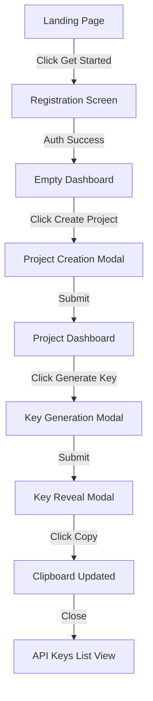
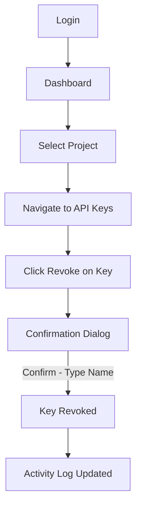
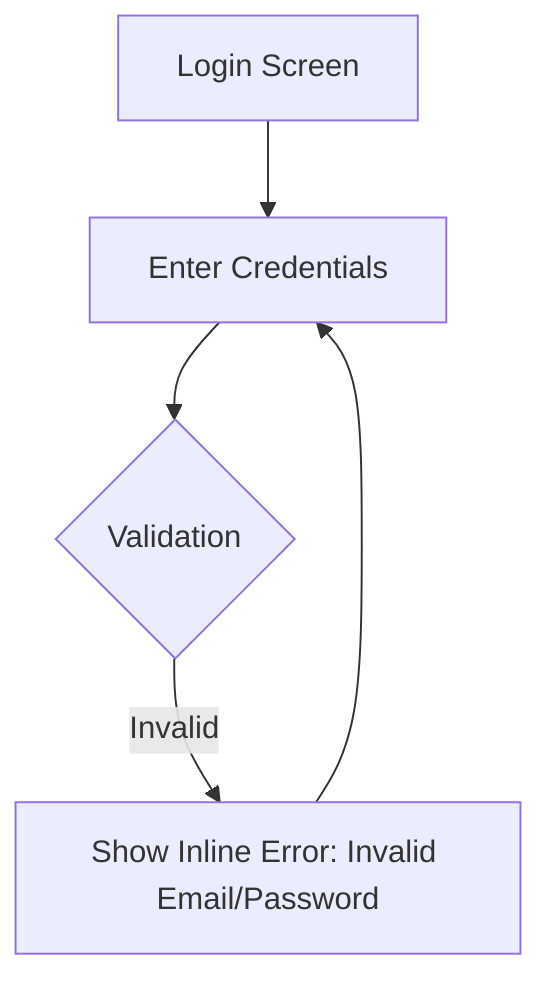

# UX Blueprint & Information Architecture

**Project Name:** APIMeter
**Version:** 1.0.0
**Status:** Approved

---

## 1. MVP DEFINITION

This section outlines the strict boundaries for Version 1.0 to ensure a focused, high-quality initial release.

### Included Features (Version 1.0)

- **Authentication:** Email/Password & GitHub Login.
- **Dashboard:** High-level metrics (Total Requests, Error Rates).
- **Projects:** Grouping API keys into isolated environments.
- **API Keys:** Generation, Naming, Copying, Revocation.
- **Request Logs:** Tabular view of API usage per project.
- **Analytics:** Line charts showing API usage over time (24h, 7d, 30d).
- **Activity Logs:** Audit trail of key creations and revocations.
- **Settings:** Project-level settings (Name, Deletion).
- **Search:** Quick search for API Keys by name.
- **Filtering:** Filter keys (Active, Revoked) and logs (Status codes).
- **Pagination:** Cursor-based pagination for logs, offset for keys.
- **Dark Mode:** Built-in system/manual toggle.
- **Responsive Design:** Desktop to mobile fluidity.
- **Profile Management:** Update name, avatar, and password.

### Excluded Features (Version 1.5+)

- **Organizations / Teams:** _Why?_ MVP focuses on individual developer utility first. RBAC adds significant complexity to the initial database schema.
- **Billing:** _Why?_ APIMeter is free for V1 to drive adoption.
- **Webhooks:** _Why?_ Asynchronous event delivery requires robust retry mechanisms. Pushed to V1.5.
- **Google OAuth:** _Why?_ GitHub covers 90% of our developer demographic.
- **Email Verification:** _Why?_ Adds friction to the "Time to first key" metric.
- **SDK:** _Why?_ V1 will use raw REST endpoints for validation. SDKs require cross-language maintenance.
- **Public API:** _Why?_ Internal APIs take priority. Public API requires strict documentation and versioning.
- **Notifications:** _Why?_ In-app/Email notifications require background workers.
- **AI Insights:** _Why?_ Requires a critical mass of log data to train and analyze effectively.
- **API Gateway:** _Why?_ V1 is a management/validation layer, not a full reverse proxy.
- **Rate Limit Policies:** _Why?_ Global rate limiting exists, but granular per-key policies require complex Redis Lua scripts postponed to V1.5.
- **Custom Domains:** _Why?_ Not necessary for a backend dashboard tool.
- **Audit Exports:** _Why?_ CSV export is a nice-to-have, but viewing logs in-app suffices for V1.

---

## 2. USER PERSONAS

### 1. Solo Developer

- **Goals:** Protect API keys from accidental GitHub commits. Track usage of side projects.
- **Pain Points:** Hardcoded `.env` files are scattered. Cannot see if a side project goes viral until the cloud bill arrives.
- **Daily Workflow:** Write code, deploy to Vercel, check APIMeter to ensure API calls are succeeding.
- **Technical Skill:** High. Prefers CLI and minimal UI.
- **Motivation:** Speed and security.
- **Success Criteria:** Can generate a key and integrate it in under 60 seconds.

### 2. Startup Founder

- **Goals:** Ensure company IP (the API) is secure.
- **Pain Points:** Lacks visibility into beta customer API usage.
- **Daily Workflow:** Reviews daily dashboards, creates keys for new B2B partners.
- **Technical Skill:** Medium. Requires visual charts.
- **Motivation:** Business growth, security compliance.
- **Success Criteria:** Can easily see top consuming keys.

### 3. Backend Engineer

- **Goals:** Validate API keys quickly without writing custom middleware logic.
- **Pain Points:** Rotating keys requires redeploying services.
- **Daily Workflow:** Writes API endpoints, integrates APIMeter validation endpoint.
- **Technical Skill:** Very High.
- **Motivation:** Reliability and automation.
- **Success Criteria:** APIMeter validation endpoint responds in <50ms.

### 4. Engineering Manager

- **Goals:** Enforce security policies and audit access.
- **Pain Points:** No visibility into staging vs. production keys.
- **Daily Workflow:** Reviews audit logs, revokes compromised keys.
- **Technical Skill:** High (architectural).
- **Motivation:** Risk mitigation.
- **Success Criteria:** Clear audit trails of who created or revoked keys.

---

## 3. USER JOURNEYS

### Core Journey: Onboarding & Key Creation



### Alternative Flow: Key Revocation (Emergency)



### Failure Path: Invalid Login



---

## 4. INFORMATION ARCHITECTURE

```text
APIMeter Platform
├── / (Marketing / Login Redirect)
├── /login
├── /register
└── /dashboard (Protected)
    ├── /projects (Overview of all projects)
    └── /projects/[id]
        ├── /overview (Charts, Stats)
        ├── /keys (API Key List & Management)
        ├── /logs (Request Logs Table)
        ├── /activity (Audit Logs)
        └── /settings
            ├── /general (Rename, Delete)
            └── /danger-zone
    ├── /profile
        ├── /general
        └── /security (Password)
```

---

## 5. SCREEN INVENTORY

| Screen               | Purpose            | Primary User  | Primary Action | Data Required    | API Dependencies         | Empty State                 |
| :------------------- | :----------------- | :------------ | :------------- | :--------------- | :----------------------- | :-------------------------- |
| **Login**            | Authenticate user  | All           | "Sign In"      | Email, Pass      | `POST /auth/login`       | N/A                         |
| **Projects List**    | Select a workspace | All           | "New Project"  | `Project[]`      | `GET /projects`          | "Create your first project" |
| **Project Overview** | High-level stats   | Founder / Eng | View Charts    | Aggregated Stats | `GET /analytics/summary` | "No usage data yet"         |
| **API Keys**         | Manage keys        | Developer     | "Generate Key" | `ApiKey[]`       | `GET /keys`              | "No keys generated"         |
| **Request Logs**     | Debug API usage    | Backend Eng   | Filter Logs    | `RequestLog[]`   | `GET /logs`              | "Waiting for first request" |
| **Activity Log**     | Audit trail        | Manager       | View Audit     | `AuditLog[]`     | `GET /activity`          | "No activity recorded"      |
| **Settings**         | Configure project  | Manager       | "Save Changes" | `Project`        | `GET /projects/:id`      | N/A                         |

---

## 6. NAVIGATION

- **Desktop Navigation:** Sidebar architecture (collapsible). Sidebar contains context-specific links (Overview, Keys, Logs, Settings) when inside a project.
- **Mobile Navigation:** Bottom tab bar for core features, hamburger menu for settings/profile.
- **Top Navigation:** Breadcrumbs (`Dashboard / Projects / Production API / Keys`), Global Search trigger (`Cmd+K`), User Avatar Dropdown.
- **Breadcrumb Rules:** Always show the path back to the global Projects list.
- **Deep Linking:** Every project, tab, and specific log entry must have a unique, shareable URL.
- **Protected Routes:** Anything under `/dashboard/*`. Redirects to `/login` if unauthenticated.

---

## 7. DASHBOARD LAYOUT

**Visual Hierarchy (Top to Bottom):**

1.  **Header:** Breadcrumbs (Left), Date Range Picker (Right).
2.  **Stat Cards (Row 1):** Total Requests, Error Rate (%), Active Keys, Avg Latency. (Minimalistic, green/red trend arrows).
3.  **Main Chart (Row 2):** Large line chart showing Request Volume over selected time. Smooth curves (Monotone X).
4.  **Split View (Row 3):**
    - _Left (60%):_ Recent Request Logs (Table: Endpoint, Status, Latency, Time).
    - _Right (40%):_ Top Consuming API Keys (List: Key Name, Request Count).

---

## 8. USER INTERACTIONS

- **Buttons:**
  - _Primary:_ Solid background (Brand color/White in dark mode).
  - _Secondary:_ Outline or Ghost.
  - _Destructive:_ Red outline, turns solid red on hover.
- **Dialogs:** Modals used for context-switching tasks (Generate Key, Confirm Deletion). Must trap focus.
- **Dropdowns:** Used for "Actions" on tables (Revoke, Edit).
- **Tables:** Sticky headers. Hover states on rows. Monospace font for IDs and Hashes.
- **Pagination:** Next/Previous buttons for cursor-based (Logs). Page numbers for offset (Projects).
- **Confirmation Dialogs:** Destructive actions (Delete Project, Revoke Key) require typing the resource name to confirm.
- **Toasts:** Bottom-right, slide-up animation. Auto-dismiss after 4s. Used for success/error feedback.
- **Keyboard Shortcuts:**
  - `Cmd + K`: Open Global Search.
  - `Esc`: Close modals.
- **Loading Indicators:** Skeleton loaders matching the component shape. No generic spinners for full-page loads.

---

## 9. EMPTY STATES

- **Projects:**
  - _Visual:_ Illustration of a folder.
  - _Copy:_ "You don't have any projects yet."
  - _CTA:_ "Create Project" (Primary Button).
- **API Keys:**
  - _Visual:_ Illustration of a key/lock.
  - _Copy:_ "No API keys found for this project."
  - _CTA:_ "Generate API Key" (Primary Button).
- **Logs:**
  - _Visual:_ Illustration of a radar/terminal.
  - _Copy:_ "Waiting for your first API request..."
  - _Sub-copy:_ "Make a request using your API key to see it appear here."
  - _CTA:_ "View Documentation" (Ghost Button).

---

## 10. ERROR STATES

| Error Type        | User Message                       | Recommended Action                          | Recovery Flow                       |
| :---------------- | :--------------------------------- | :------------------------------------------ | :---------------------------------- |
| **Auth 401**      | "Your session has expired."        | "Please log in again."                      | Redirect to `/login?next=...`       |
| **404 Not Found** | "We couldn't find this page."      | "Return to Dashboard"                       | Link to `/dashboard`                |
| **500 Server**    | "Something went wrong on our end." | "Try again or contact support."             | Refresh page button                 |
| **Validation**    | "Invalid format." (Inline)         | "Check the highlighted fields."             | Auto-focus invalid input            |
| **Network**       | "You are offline."                 | "Check your internet connection."           | Show offline banner, retry silently |
| **Rate Limited**  | "Whoa, slow down."                 | "Please wait a moment before trying again." | Show countdown timer                |

---

## 11. RESPONSIVE BEHAVIOR

- **Desktop (>1024px):** Sidebar visible permanently. Complex charts render fully. Tables show all columns.
- **Tablet (768px - 1024px):** Sidebar becomes collapsible. Tables hide low-priority columns (e.g., Latency).
- **Mobile (<768px):** Sidebar converts to bottom navigation or hamburger menu. Charts simplify to sparklines. Tables convert to stacked card lists. Modals become full-screen slide-overs.

---

## 12. ACCESSIBILITY (A11y)

- **Keyboard Navigation:** All interactive elements must be reachable via `Tab`.
- **Focus Management:** Modals must trap focus. Returning from a modal restores focus to the triggering button.
- **ARIA Requirements:** `aria-live="polite"` for toast notifications. `aria-hidden="true"` for decorative icons.
- **Contrast:** Minimum 4.5:1 contrast ratio for all text against backgrounds (especially critical in Dark Mode).
- **Screen Readers:** Icon-only buttons must have `<span class="sr-only">Description</span>`.
- **Reduced Motion:** Respect `prefers-reduced-motion` CSS media query by disabling Framer Motion animations.

---

## 13. DESIGN PRINCIPLES (The APIMeter Aesthetic)

Inspired heavily by **Vercel, Linear, and Stripe.**

- **Visual Philosophy:** Utilitarian, sleek, and highly technical. Zero visual clutter.
- **Spacing:** Strict 8px grid system. Generous padding inside cards, tight margins between related items.
- **Hierarchy:** High contrast between primary data (e.g., Request Count) and secondary data (e.g., Timestamps).
- **Color Usage:**
  - _Backgrounds:_ Slate/Zinc palette (Dark mode: `#09090b`, Light mode: `#ffffff`).
  - _Accents:_ A single vibrant brand color (e.g., Indigo or Electric Blue) used sparingly for primary actions.
  - _Status:_ Green (Success/200), Amber (Warning/429), Red (Error/500).
- **Typography:** Sans-serif (Inter or Geist). Monospace (JetBrains Mono or Fira Code) exclusively for API Keys, IDs, and Logs.
- **Motion:** Extremely subtle. 150ms ease-in-out transitions for hovers. No bouncy or distracting animations.
- **Density:** Compact. Engineers prefer seeing more data on screen rather than massive padding.

---

## 14. ACCEPTANCE CHECKLIST

- [x] Every screen defined (Login, Dashboard, Projects, Keys, Logs, Settings).
- [x] Core user journeys mapped with flowcharts.
- [x] Empty states defined with appropriate Copy and CTAs.
- [x] Error states mapped with recovery flows.
- [x] Clear MVP boundaries defined (Excluded features documented).
- [x] Navigation hierarchy strictly enforced.
- [x] Responsive behavior behavior documented (Mobile to Desktop).
- [x] Accessibility (A11y) requirements set.
- [x] Design philosophy and visual tokens established.

---

_End of Document_
